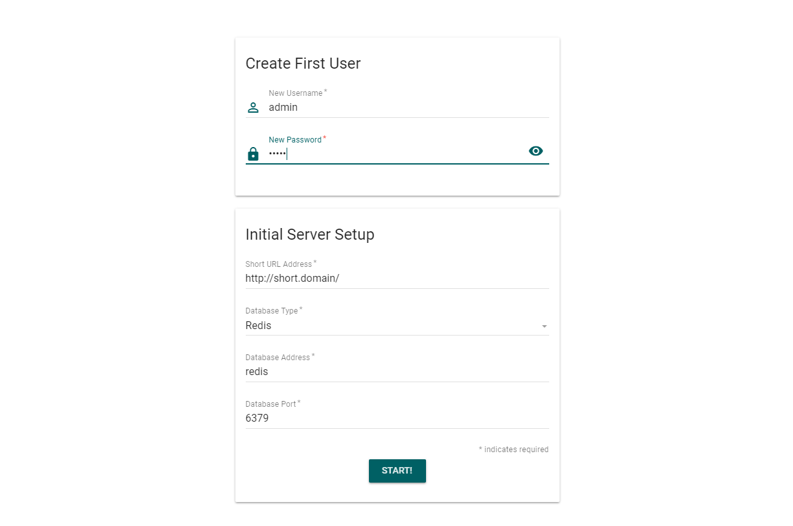
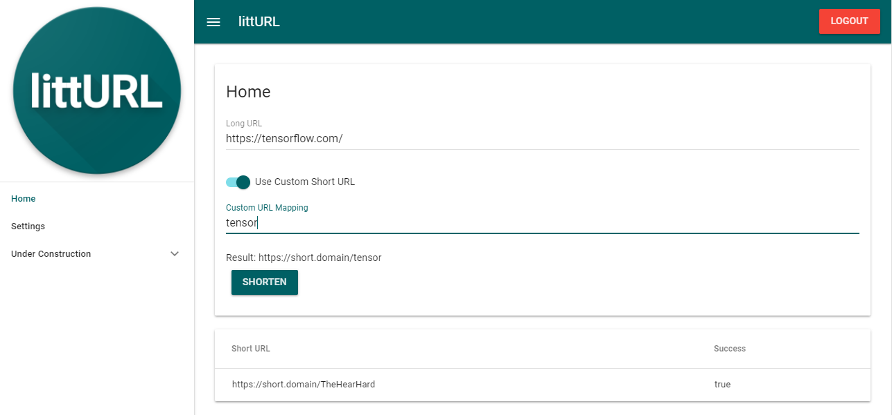
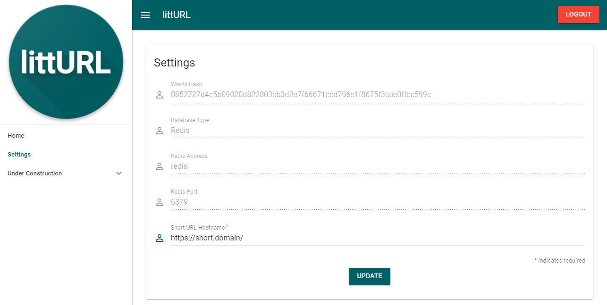

# littURL
[](https://circleci.com/gh/matmerr/litturl)
[](https://goreportcard.com/report/github.com/matmerr/litturl)


> A little URL shortener.
## Features:
- Self Hosted URL Shortener
- Simple installation with Docker
- Material Design using [VueMaterial](http://vuematerial.io/#/) and [Vue.JS](https://vuejs.org/)


## Get up and running with Docker Compose 
[](https://microbadger.com/images/matmerr/litturl)
[]()

> If you don't have Docker Compose installed, [check this out](https://docs.docker.com/compose/install/#install-as-a-container)

```
# clone the repository
git clone https://github.com/matmerr/litturl

# cd to repo
cd litturl

# bring it up
docker-compose up -d
```
## Or if you have a Redis instance
> note: by default uses db 0
```
# clone the repository
git clone https://github.com/matmerr/litturl

# cd to repo
cd litturl

# bring it up with or with persistant storage
docker run -d -p 8001:8001 -v /host/dir/conf_dir:/go/src/github.com/matmerr/litturl/conf matmerr/litturl
```


## Screenshots

### **Inital Setup:**
[]()
### **Home:**
[]()
### **Settings:**
[]()


## TODO's
- Multiuser authentication
- BYODB for others besides Redis
- Google Analytics / Click Statistics